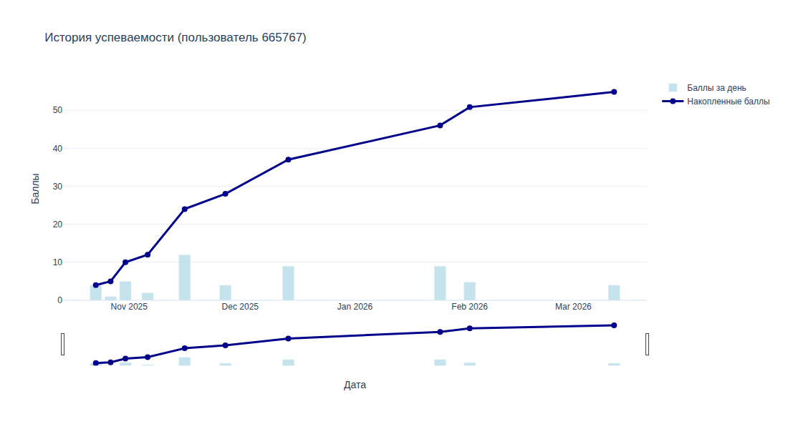
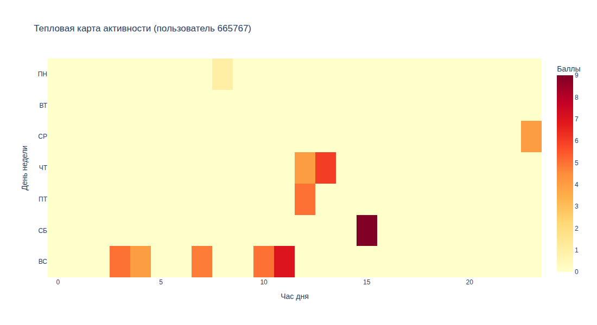
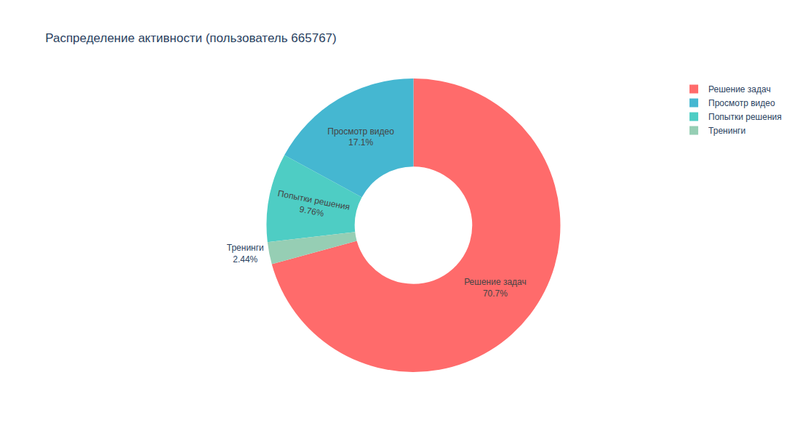
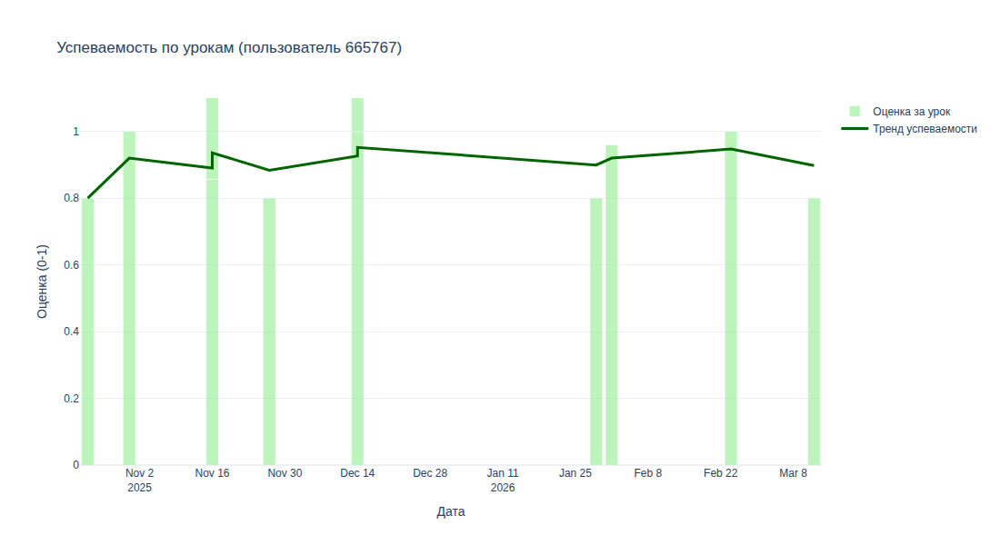
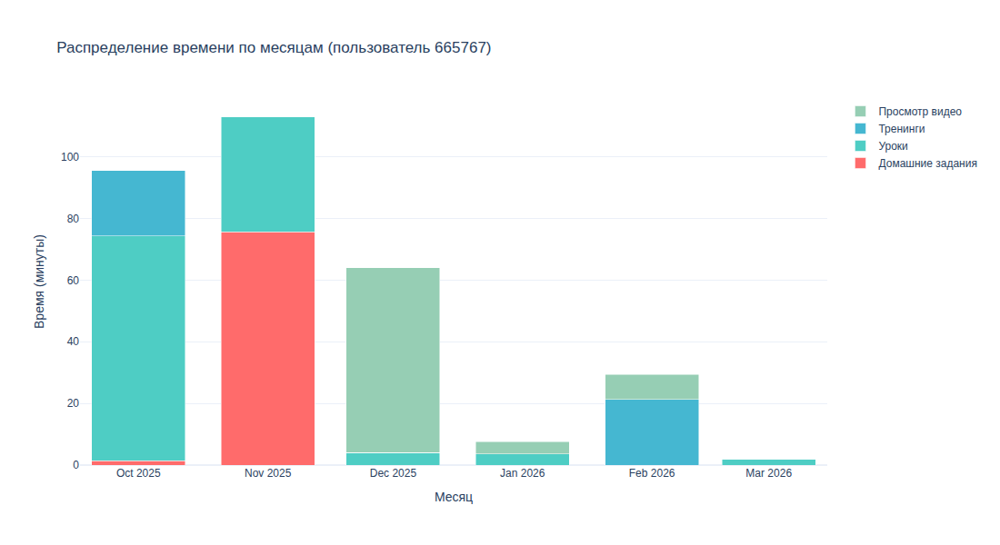

# Персональный отчёт об обучении школьника

Решение командного хакатона по продуктовой аналитике ([название хакатона], [организатор], [месяц] 2026).

**Задача:** придумать содержание отчёта, который онлайн-платформа обучения показывает школьнику о его учёбе. На вход идёт выгрузка активности анонимизированных учеников (16 таблиц: ответы на задачи, просмотры видео, уроки, тренинги, достижения и др.).

**Решение:** набор из 40+ метрик успеваемости и активности, интерактивные графики на Plotly и концепция отчёта с адаптивными блоками и персонажем-компаньоном.



## Концепция отчёта

- **Метрики в четырёх группах:** успеваемость (доля пройденного курса, решённые задачи, досмотр видео), сравнение и активность (место среди учеников своего города, тренинги, вебинары), качество (решение с первой попытки, самый продуктивный день и час, время от вебинара до домашки), темпоральные метрики (активность после полуночи, равномерность накопления баллов).
- **Адаптивные блоки:** набор и порядок блоков отчёта меняются в зависимости от значений метрик, ученик видит ту информацию, которая мотивирует его учиться дальше и делиться своим отчётом с одноклассниками.
- **Персонаж-компаньон:** генерируется по результатам пяти ключевых метрик и меняется вместе с прогрессом ученика. Это элемент геймификации, который мотивирует возвращаться на платформу и делиться отчётом.

Презентация решения и макет тестового отчёта: [ссылка].

## Примеры графиков

| Тепловая карта активности | Распределение активности |
| --- | --- |
|  |  |

| Успеваемость по урокам | Активность по месяцам |
| --- | --- |
|  |  |

Интерактивные версии лежат в [`examples/plots/`](examples/plots/) (откройте HTML-файл в браузере после скачивания), пример текстового отчёта — в [`examples/report_example.txt`](examples/report_example.txt).

## Структура

```
├── main.py            # точка входа: текстовый отчёт + графики
├── data_loader.py     # загрузка CSV-таблиц выгрузки
├── metrics.py         # расчёт метрик и построение графиков
├── report.py          # форматирование текстового отчёта
├── examples/          # пример результата для одного ученика
└── images/            # скриншоты графиков для README
```

## Запуск

```bash
pip install -r requirements.txt
```

1. Положите CSV-таблицы выгрузки в папку и укажите путь в `DATA_PATH` в `data_loader.py`.
2. Укажите `user_id` ученика в `main.py`.
3. Запустите `python main.py`.

Результат: текстовый отчёт `report_user_<id>.txt` и папка `plots_user_<id>/` с HTML-графиками.

Исходные данные хакатона не публикуются: они принадлежат организатору.

## Известные ограничения

- В выгрузке не заполнена длительность видео (`wk_video_duration`), поэтому суммарная длительность просмотренных вебинаров не считается.
- Время на задачу считается от начала решения до отправки ответа, поэтому включает периоды, когда задача учеником не решалась. Для отчёта стоит отсекать выбросы.
- Доля пройденного курса берётся из агрегатов платформы (`user_courses`), а доля решённых задач — из сырых ответов (`user_answers`), поэтому значения могут не совпадать. Связано с ограничениями исходных данных

## Команда

- **Фёдор Цибуля** — темпоральные метрики (активность после полуночи, равномерность и динамика накопления баллов, время на видео и ответы), дизайн и композиция отчёта, концепция интерактивных HTML графиков, концепция персонажа-компаньона, организация работы команды
- **[Дина Фамилия]** — метрики успеваемости, дизайн персонажей и работа с нейросетями
- **[Полина Фамилия]** — метрики сравнения и активности, концепция светлой/тёмной стороны, презентация проекта
- **[Лена Фамилия]** — метрики качества и продуктивных периодов, консолидация и тестирование кода, логика адаптивных блоков